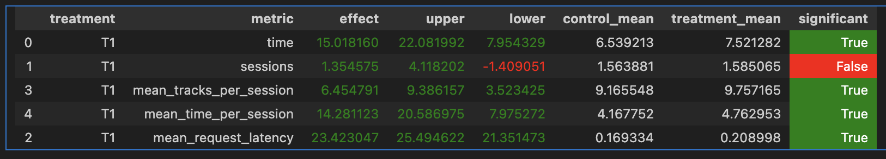

**Abstract**  
Код рекоммендера можно найти в файле `my.py` `MyRecommender`.

Основная идея эксперимента заключается в том, чтобы адаптировать подход к рекомендациям в зависимости от времени, проведенного пользователем с последним прослушанным треком, а также от предыдущих интеракций пользователя и "грамотной" комбинации уже имеющихся у нас рекоммендеров.

Мы установили "лимит" по которому мы используем контекстуальную рекомендацию если трек прослушан хотя бы `limit` от его обзей длины, а иначе переиспользуем персональную рекомендацию

Значение лимита было установлено опытным путём, так же активно пытался интегрировать лругие комбинации, но эта покащала себя лучше всего на наших симуляциях.

**Результаты A/B эксперимента**  


Эксперимент показал, что новая система рекомендаций увеличивает нужную нам метрику (`significant=true` на `mean_session_time`)

**Ссылка на репозиторий и инструкция по запуску**  

Для запуска эксперемента выполните следующие шаги:

1. Запустить сервисы через Docker:
   ```bash
   docker-compose up --build --force-recreate --scale recommender=1
   ```
2. Запустить симуляцию (я обычно делал 2-3 дня, не больше. Этого на мой взгляд хватает, чтобы проверить эффективность):
   ```bash
   python -m sim.run --episodes 1500 --config config/env.yml single --recommender remote --seed 4321
   ```
3. Скопировать данные для анализа:
   ```bash
   python dataclient.py --recommender 1 log2local ~/Desktop/data
   ```
5. Запустить эксп в Jupyter Notebook, предварительно выставив пути к данным.
