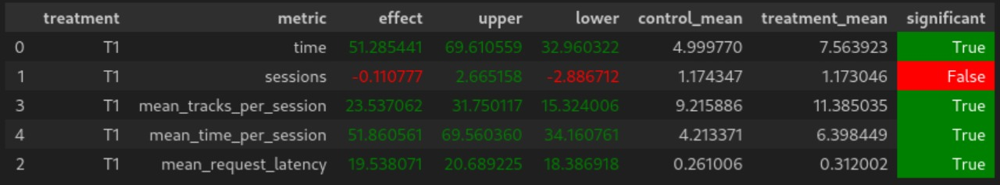

## Идея

Сразу осознав, что лучше чем dssm модель сделать сейчас не смогу за разумное время, решил ультимативно навесить на неё почти всё что было в курсе, совместив лучшее с лучшим и добавив знания о предпочтениях пользователей.

## Детали

Взял лучший index рекомендер - dssm.
Лучший контекстный - div.
И StickyArtist.

Как смог склеил их, попутно проверяя что бы юзер не слушал один трек дважды и слишком много раз одного исполнителя.

Сначала идет dssm, с проверками.
Если не прошло, но предыдущий трек достаточно понравился, StickyArtist, так же с проверками.

И, на конец, смотрим что порекомендует div, если и оно не подошло, то уже просто рандомом.

## Результат



## Ссылка на репозиторий и инструкцию по запуску.

https://github.com/UyraIV/recsys-course-spring-2024

Запуск вроде ничем не должен отличатся от обычного что был в курсе.

Только нужно поправить пути в ноутбуке первого семинара

```
docker-compose up -d --build --force-recreate --scale recommender=2
```

```
python -m sim.run --episodes 1000 --config config/env.yml single --recommender remote --seed 31337
```

здесь тоже свой путь куда выгружать
```
python dataclient.py --recommender 2 log2local ПУТЬ 
```

запустить Week1Seminar.ipynb