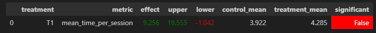
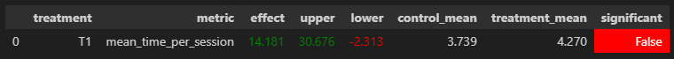

Убрал возможность повторной выдачи треков у dssm

Сразу нахожу рекомендации у двух рекомендеров (дссм и контекстуальный), и беру пересекающееся результаты, если такие есть

/botify (master)
$ docker-compose up -d --build --force-recreate --scale recommender=2

дождаться пока некст штука покажет INFO in server: Botify service stared
/botify (master)
$ docker logs botify-recommender-2

/sim (master)
$ python -m sim.run --episodes 1000 --config config/env.yml single --recommender remote --seed 31337

/script (master)
$ python dataclient.py --recommender 2 log2local ~/Desktop/data

далее полный запуск 

Week1Seminar
