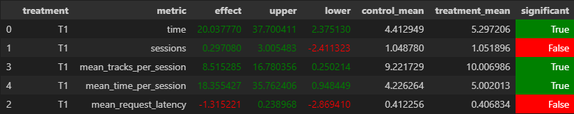

# Домашнее задание 2.

##1. Идея эксперимента

Раз нужно победить нейросетевой рекомендер DSSM, тогда просто модифицируем нейросетевой рекомендер таким образом, чтобы улучшить его результат.
Взял за базу Contextual из семинаров и попробовал научить его выбирать трек на умном рандоме. Запоминать треки, которые пользователь слушал в течении дня и если первый трек нравится больше второго, то выбрать его будет более вероятнее. Но этого было недостаточно для преодоления метрики.

Тогда попробовал ориентироваться на продолжительность прослушивания во время сессий. Так как предыдущий трек мог не понравиться пользователю (пользователь его скипнул), тогда не стоит предлагать рекомендацию для этого пропущенного трека или стараться выбрать из них даже по-умному. Гораздо больше смысла предлагать пользователю трек, рекомендуемый по последнему понравившемуся треку (дослушенному), а в обратном случаи попробовать дать персональные рекомендации.

##2. Детали

Реализован [рекомендер](botify/botify/recommenders/contextualmod.py):

В качестве fallback будет выступать DSSM для рекомендера Contextual. 
В runtime будет определяться трек для пользователя, прослушавшего трек дольше определенного времени (константа SOLUTION_TIME). 
Если трек не понравился, будет выбран другой через персональную рекомендацию. 

##3. Результаты A/B эксперимента

Данные получены благодаря симуляции 10000 итерации.
Для быстроты исполнения теста данные лежат в (\script\cache)

, где T7 – реализованный алгоритм. T4 – наш baseline

##4. Инструкции

У меня Win11 c симуляцией conda, поэтому оставляю инструкцию для нее. Также использовал последнюю версию gym и танцевал с бубном.
В остальном программа запускается, тестируется и используется согласно описанию на семинарах, а также в выложенных Readme:

1. Запустить botify: 
```
docker-compose up -d --build --force-recreate --scale recommender=2
```
2. Запустить sim
```
conda create -n recsys-2024 python==3.8
conda activate recsys-2024
pip install -r requirements.txt
python -m sim.run --episodes 10000 --config config/env.yml single --recommender remote --seed 31337 
```
3. Забрать данные
```
python dataclient.py --recommender 2 log2local ./cache/
```
4. Посмотреть результаты в [Week1Seminar.ipynb](jupyter/Week1Seminar.ipynb)
Вывел все рекомендеры для сравнения как предлагалось в предпоследней лекции.

