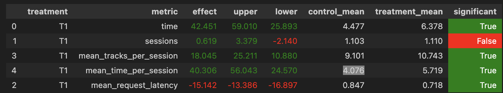

## Abstract

Выдаем рекоммендации DSSM в том порядке, в котором они есть, ведь они идут в порядке близости эмбеддингов к пользователю


## Детали

Новый рекоммендер реализован в файле `my_recommender.py`, класс `MyRecommender`


## Результаты

Улучшили исходный рекоммендер по интересующей метрике на 56 процентов




## Инструкция по запуску

1. ```commandline
   cd botify
   docker compose up --detach --build --force-recreate --scale recommender=2
   ```

2. ```commandline
   cd ../sim
   python -m sim.run --episodes 1000 --config config/env.yml single --recommender remote --seed 31337
   ```

3. ```commandline
   cd ../script
   python dataclient.py --recommender 2 log2local ~/Desktop/data
   ```
   
4. Запустить ноутбук `Week1Seminar.ipynb`, поменяв место, откуда берутся данные