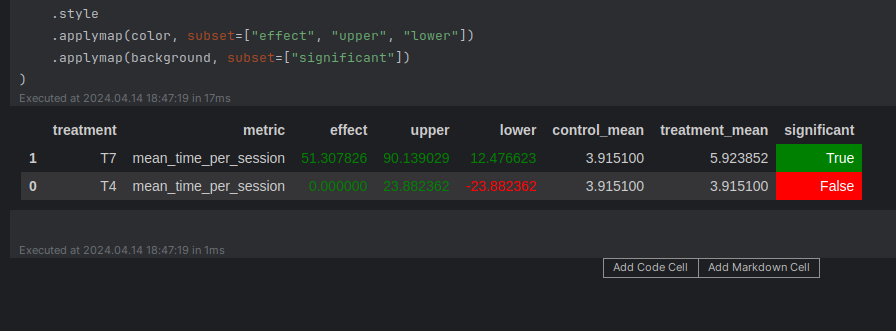

# HW2

## Abstract

Взять бейзлайновый DSSM (recommendations_dssm) и накрутить на него какую-нибудь интересную эвристику.

Если слушателю понравился трек из топ-100, значит он точно не хейтер мейнстримной музыки и если в рекомендациях от DSSM есть, что-то из топа, то порекомендуем.

## Детали

В файле `custom.py` реализовал класс `CustomRecommender`. Мы просто берём случайны трек из рекомендаций от DSSM

Если слушатель прослушал `80%` трека из топ-100, порекомендуем ему трек от DSSM который есть в топ-100, иначе просто случайный трек от DSSM

В файле `server.py` добавили наш рекомендер к остальным


## Результаты A/B эксперимента



## Как повторить эксперимент

### Повтор

В репозиторий уже загружены результаты в файле [cache/botify-recommender-1/data.json](./cache/botify-recommender-1/data.json). Можно сразу перейти к просмотру

```shell
# Запускаем Botify (Нужно немного подождать пока запуститься
cd botify
docker-compose up -d --build --force-recreate --scale recommender=1
```

```shell
# Запускаем симуляцию
cd ../sim
python -m sim.run --episodes 4000 --config config/env.yml single --recommender remote --seed 31337
cd ..
```

```shell
# Чистим кэш
rm -rf cache
```

```shell
# Сохраняем результаты
python ./script/dataclient.py --recommender 1 log2local ./cache/
```

```shell
# Останавливаем Botify
docker-compose stop
```

### Просмотр

Для просмотра результатов смотрим [Week 1 Seminar](./jupyter/Week1Seminar.ipynb). 

T4 - бейзлайн (DSSM). T7 - наша эвристичка.
