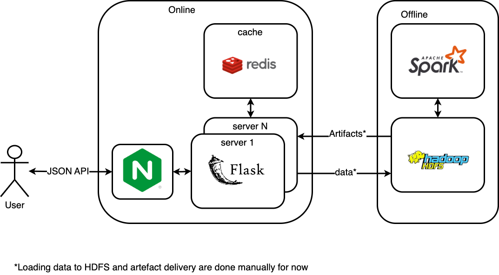

# Botify

Сервис рекомендаций реализован как приложение на [Flask](https://flask-restful.readthedocs.io/en/latest/).
Это приложение умеет обрабатывать запросы по REST API.
В качестве in-memory кэша используется [Redis](https://redis.io/).
В качестве load balancer используется [nginx](https://www.nginx.com/)
Приложение пишет лог событий в json в папку `/app/log/`



## Инструкция

1. [Устанавливаем docker](https://www.docker.com/products/docker-desktop)
1. Собираем образы и запускаем контейнеры (2 рекомендера в параллель)
   ```
   docker-compose up -d --build --scale recommender=N
   ```   
1. Смотрим логи рекомендера
   ```
   docker logs botify_recommender_n
   ```
1. Останавливаем контейнеры
   ```
   docker-compose stop
   ```
1. Модифицируем код в этом модуле
1. Повторяем шаги 2-4, пока не достигнем поставленной цели 

## Полезные команды
Проверяем, что сервис жив
```
curl http://localhost:5000/
```
Запрашиваем информацию по треку
```
curl http://localhost:5000/track/42
```
Запрашиваем следующий трек
```
curl -H "Content-Type: application/json" -X POST -d '{"track":10,"time":0.3}'  http://localhost:5000/next/1
```
Завершаем пользовательскую сессию
```
curl -H "Content-Type: application/json" -X POST -d '{"track":10,"time":0.3}'  http://localhost:5000/last/1
```
Скачиваем логи пользовательских сессии с контейнера
```
docker cp botify_recommender_n:/app/log/ /tmp/
```
Мониторим загрузку хостов
```
docker stats botify_recommender_1 botify_nginx_1 redis-container
```
