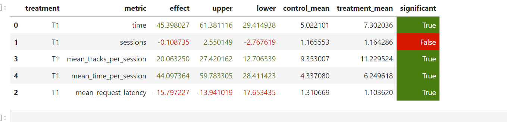

## ReferenceRecommender:

### Основная идея:

После пересмотра всех лекций, было принято решение совместить DSSM и Contextual рекоммендоры.

* Почему именно они? DSSM - лучшее решение с лекций, его можно модифицировать и улучшить.
* Как модифицировать? При использовании DSSM модели мы получаем список рекомендаций треков, в порядке убывания
  релевантности(ембединги схожести треков с юзером). Бейзлайн - взятие рандомного трека.
* Самое первое и простое, что приходит в голову - брать треки по порядку списка и брать очень
  жадно ```update_dssm_idx```, но тут нужно
  подумать.
* Что если рекомендации с DSSM закончатся? Я пробовал разные подходы, но пришел к тому, что лучше брать треки циклично -
  если индекс вышел за границу, то следует обнулять его и брать рекомендации сначала.
* Да, тут рекоммендер может попасть в "петлю" треков, и рекомендовать одно и то же, но этот случай я также рассмотрел.
* Я добавил историю прослушанных треков ```check_listened```: если трек уже рекомендовали - то рекомендуем случайный,
  что позволяет выйти из
  петли описанной выше. Также эта фича поможет в следующих моих идеях.
* При тестировании рекоммендора в ручном режиме, я заметил, что DSSM иногда рекомендует нерелевантные треки, если
  пользоваться методом - проходиться с начала до конца, который я описал выше.
  def custom_contextual(self, user: int, prev_track: int, prev_track_time: float) -> int:
* Поэтому я добавил еще одну фичу ```custom_contextual```: если DSSM три раза подряд рекомендует трек плохо(время
  прослушивания пользователя
  меньше "плохой" границы ```maintain_features```), то я запускаю CustomContextual рекоммендер.
* CustomContextual рекоммендер пробует порекомендовать похожие треки на релевантные(время прослушивания пользователя
  которых больше "хорошей" границы ```maintain_features```), такие треки я сохраняю,
  если таких нет, то CustomContextual пробует порекомендовать похожий трек на самый релеватный```store_most_relevant```(
  время прослушивания этого
  трека пользователем больше всего).
* То есть, по факту, если DSSM рекомендует плохо, я пытаюсь скорректировать его(дать ему второй шанс), при помощи
  Contextual, рекомендуя похожие.
* Eсли получилось его скорректировать при помощи Contextual, то DSSM будет дальше хорошо
  рекоммендовать.
* Надеюсь я смог донести основную идею, проще посмотреть в код. ::>> check ```reference.py```

### Commands:

```shell
cd C:\Users\hedwi\Desktop\CS-spring-2024\Recsys-vk-spring-2024\recsys-course-spring-2024\botify
```

```bash
docker-compose stop 
docker-compose up -d --build --force-recreate --scale recommender=2
```

```bash
docker logs botify-recommender-2
curl http://localhost:5001/
```

```bash
cd ../sim
conda activate recsys-2024
python -m sim.run --episodes 700 --config config/env.yml multi --processes 4 
```

```bash
cd ../script
python dataclient.py --recommender 2 log2local C:/Users/hedwi/Desktop/CS-spring-2024/Recsys-vk-spring-2024/recsys-course-spring-2024/jupyter/user_sessions
```

* P.S. You can change your path to botify, I use
  path: ```C:\Users\hedwi\Desktop\CS-spring-2024\Recsys-vk-spring-2024\recsys-course-spring-2024\botify```

### Test result:



### Итоги:

* У меня действительно получилось улучшить работу рекоммендора DSSM!