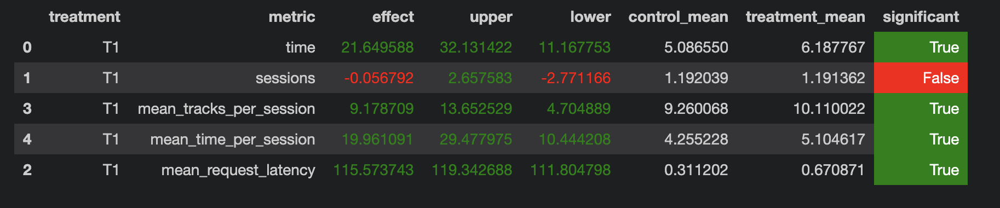

## Отчет по домашнему заданию № 2

Суть/идея: я решила смёрджить рекомендации модели DSSM и GCF (код находится в ```botify/botify/recommenders/my_recommender.py```). 

**Почему именно данные модели?**
- DSSM - лучшая из рассмотренных моделей. Суть этой модели в том, что она моделирует семантическое сходство между парой строк, где строки - это данные треков.
- GCF - не самая лучшая модель, но на контрасте с DSSM она рассматривает треки и пользователей как скалярное произведение эмбеддингов этих двух сущностей.

То есть комбинация этих двух моделей будет обладать свойствами выдавать похожие по признакам треки (dssm), а также учитывать интересы пользователей исходя из опыта (gcf).

**Что я сделала?**

Для этого очевидно нужно создать некую приоритетность, 
что я и сделала в методе MyRecommender.get_combined_tracks(). Эмпирическим путем я проверила, какую приоритетность нужно
дать трекам, полученных из двух моделей. Также мне нужно учитывать, чтобы треки не попадались снова: для этого был придуман массив used. 
К тому же dssm и gcf выдавали рандомную рекомендацию из сета треков, в то время как они отсортированы по релевантности, чем я и воспользовалась в обеих моделях. Я мёрджу треки так, чтобы самые релевантные выдавались в первую очередь.

**Что я заметила из подбора параметров для приоритетности рекомендеров?**

- Если делать модель DSSM менее приоритетной, то результат получался хуже, чего
и следовало ожидать, так как если сравнивать эти две модели по одиночке, то GCF показывает менее хорошие результаты.

- При этом если поставить для DSSM приоритетность > 0.6, а для GCF < 0.4, то результаты также ухудшатся. 

**Что я сделала и что у меня не получилось?**
- Пыталась внедрить контекст по последней прослушанной песни, то есть если пользователю понравилось то, что модель выдала ему в прошлый раз, то стоит найти похожие песни на эту.
Однако AB-тест показал намного более худшие результаты (ухудшились все метрики, кроме mean_tracks_per_session и mean_time_per_session)

**Команды, которые я использовала:**

В botify:
```
docker-compose stop  
docker-compose up --build --force-recreate --scale recommender=2
```

Поскольку я использую без опции -d, то мне не нужно вводить отдельные проверки, чтобы понять всё ли загрузилось в redis или что мой сервис жив.

В sim:
```
python -m sim.run --episodes 3500 --config config/env.yml single --recommender remote --seed 31337
```

В script:
``` 
python dataclient.py --recommender 2 log2local ~/Desktop/data
```

**AB-тест проводился как на первой практике - ноутбук ab_test.** 

Результат:




**Идеи на будущее:**
- использовать LGCN