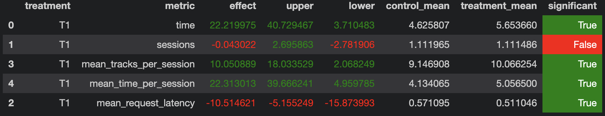

# HW2

## Описание решения

Возьмём предсказания DSSM и будем выдавать их по порядку до тех пор, пока пользователю нравятся треки. Будем считать, что пользователю не понравился предыдущий рекомендованный трек, если время прослушивания было < 0.3. Если предыдущий трек не понравился пользователю, то начнём рекомендовать треки с нулевого. При этом если пользователь послушал < 6 различных треков, то продолжим рекомендовать их по порядку, даже если они ему не нравятся. Решение реализовано в файле `./botify/botify/recommenders/HWRecommender.py`.

## Результаты A/B-теста

## Инструкция по запуску

- Запустить botify: `docker-compose up -d --build --force-recreate --scale recommender=2`
- Запустить sim на >= 2000 эпизодов: `python -m sim.run --episodes 2000 --config config/env.yml single --recommender remote --seed 42`
- Скачать логи из botify: `docker cp botify-recommender-1:/app/log/ /tmp/`, `docker cp botify-recommender-2:/app/log/ /tmp/`
- Запустить ноутбук `./hw-solution/ab_test.ipynb`, он в конце покажет результаты A/B-теста