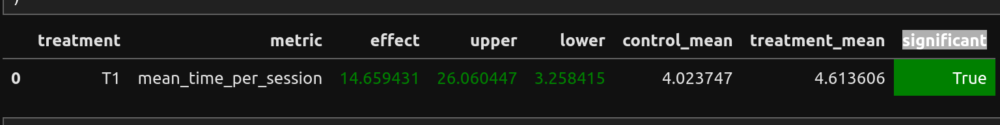

###  Отчет

Эксперимент по улучшению DSSM-рекоммендора.
Если рекоммендор не дал результатов, то тогда используется fallback-рекоммендор.
Если сыгранный трек нету в результате рекоммендора, то тогда играется первая песня.
Проверяется последние 5 треков, если пользователь быстро их скипал, то тогда используется fallback-рекоммендор.
Если в какой-то момент прослушали песню быстро и плейлист далеко проигран, выбирается первая из рекомендаций.

Также еще есть каскад рекомендаций



### Повторение эксперимента

1. В папке `botify`
    ```shell
   docker compose up -d --build --force-recreate --scale recommender=1
   ```
2. В папке `sim`
    ```shell
   python3 -m sim.run --episodes 3000 --config config/env.yml single --recommender remote --seed 533
   ```
3. В корневой папке
    ```shell
    python ./script/dataclient.py --recommender 1 log2local ./cache/
    ```
4. Проверяем в `experiment.ipynb` результаты