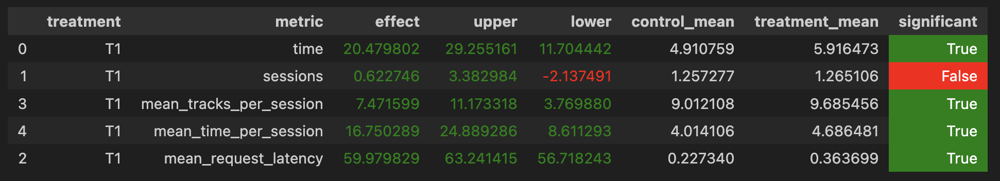

# Идея

Ансамбль из рекоммендеров: в разных ситуациях в зависимости от `prev_track_time` применять различные методы подбора следующего трека для пользователя.

# Реализация

Если пользователь прослушал предыдущий трек практически до конца (>90%), тогда ему будет вероятно интересно послушать похожий - контекстный рекоммендер. Далее путем подбора параметров нашел следующее - от 70% до 90% будем использовать LightFM, если ниже - DSSM. При этом рекомендовать будем случайный из топ-3 рекомендаций для пользователя, а не перемешивать все. Фоллбеки будем отправлять все на DSSM, с нее на Random.

# Технические детали

Реализовал класс Custom для своего рекоммендера, прокинул во все файлы, разобрался как запускать с ним тесты.

## Возникшие проблемы и их решение

Использую Macbook Pro M1, в связи с этим были проблемы с установкой библиотек. Последовательность действий, которая мне помогла (знания добыты на [stackoverflow](stackoverflow.com)):

* Создать конду вот так `CONDA_SUBDIR=osx-64 conda create -n recsys-2024 python=3.8.18`
* Убрать из `requirements` библиотеку `gym`
* `pip install -r ./sim/requirements.txt`
* `pip install pip==21`
* `pip install wheel==0.38.0`
* `pip install setuptools==65.5.0`
* `pip install gym==0.20.0`
  
Также в силу невыясненных мной причин на порту 5001 не работало, перенес на 5002

# Результат

Данные, по которым получена таблица лежат в `hw/hw2_data/data.json`

# Воспроизведение

Процедуру для мака описывал выше, какна остальных машинах не знаю, предположим, все нужное стоит

1. `cd botify; docker-compose up -d --build --force-recreate --scale recommender=1`
1. Докер запустился
1. `cd ../sim; python -m sim.run --episodes 10000 --config config/env.yml multi --processes 2`
1. Пункт 3 может быть капризным, оказалось очень система как-то сильно чувствительна к нагрузке, но такая комбинация параметров у меня работала
1. `docker cp botify-recommender-2:/app/log/ /tmp/try123` - Здесь `/tmp/try123` - placeholder директория, ее же нужно подставить в следующем пункте
1. В ноутбуке `Week1Seminar.ipynb` подставить директорию из предыдущего пункта в переменную `DATA_DIR` и запустить все
  