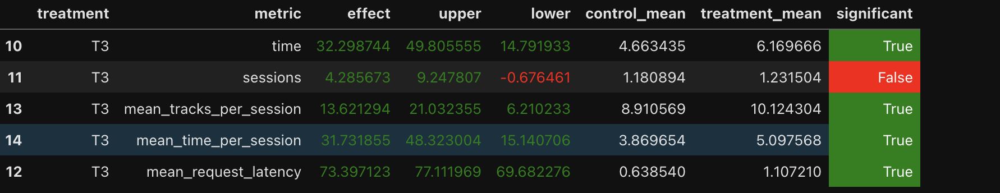

# Домашнее задание 2. Рекомендер музыкальных треков. Отчёт

*Дедлайн: 14 апреля 2024 23:59 MSK* 

### Abstract: основная идея эксперимента 
    
Если пользователю понравился трек (слушал долго), то ему скорее всего понравятся похожие, учитывая это, 
рекомендуем "соседний" трек. В противном случае рекомендуем случайный из всех рекомендованных для него. 
То есть совмещаем contextual recommender и indexed recommender.
Также добавим возможность влиять на повторение исполнителей (в рамках соседних рекомендаций) - добавим проверку на совпадение 
их у предыдущего трека и сгенерированной рекомендации, повторим процесс генерации, если совпали.
    
    
### 2. Детали: минимум того, что нужно знать, чтобы разобраться в реализации

В файле `contextualIndexed.py` реализован рекомендер, который берёт рекомендацию Contextual, 
если прослушивание > threshold и рекомендацию Indexed в противном случае.

Если рекомендер инициализирован с `flg=True`, проверяем на совпадение исполнителей и перерекомендовываем.

В файле `server.py` тестирую новый рекомендер с разными параметрами: threshold, 
рекомендеры с треками под пользователя (ligthfm, dssm) и включаю/выключаю перерекомендацию в случае совпадения исполнителей.

(Еще меняю дефолтный рекомендер, c рандома, например, на рекомендацию популярных - пояснение для Treatment.T3)


###  3. Результаты A/B эксперимента - в табличке как на семинарах (1 параграф + табличка)

Рекомендер, соответствующий T3, показал результат выше остальных;
**mean_time_per_session значимо выросла с 3.87 до 5.10**



прим. запуск такой: 
```
docker-compose up -d --build --force-recreate --scale recommender=2
cd ../sim
python3 -m sim.run --episodes 4000 --config config/env.yml single --recommender remote --seed 31337
cd ../script
python3 dataclient.py --recommender 2 log2local ~/Desktop/data
```
(+ ноутбук с первого семинара для вычисления метрик)


   