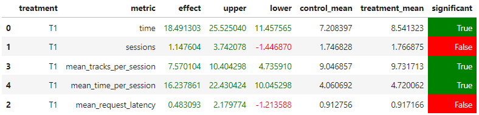

## Abstract

- Добавим для каждого трека фичу (`actor_index`), отражающую исполнителя. 
- Поменяем архитекуру `ItemNet`, чтобы считать эмбеддинг для `actor_index` и обучим DSSM. 

## Детали
- Сопоставим каждому автору какое-то число
- Добавим в `track_metadata` столбец `actor_index`, в котором будет находиться индекс, соответствующий автору трека
- Изменим архитектуру модели - размер эмбеддинга для жанра повысим до 64, а также по аналогии будем считать эмбеддинг для `actor_index`
- Подсчитаем рекоммендации для юзеров (как раньше считали для DSSM)
- Добавим эксперимент `DSSM_UPDATED`, где в тритменте будем использовать новые рекомендации вместо старых


## Результаты

Получился значимый эффект для метрики `mean_time_per_session` по сравнению с обычными рекоммендациями DSSM (запуск был с `--episodes 10000`)

## Инструкция

- Либо запустите обновлённую версию ноутбука `jupyter/Week5Seminar.ipynb` и скачайте полученные новые рекоммендации `recommendations_dssm_updated.json`, либо возьмите необходимые артефакты с диска: [диск](https://drive.google.com/drive/folders/1qWfZrdgPkStHdJJiCwdwof5PsIuHkziO?usp=sharing)
- Если требуется замените локальный `recommendations_dssm_updated.json` на новый
- Запустите botify (из директории `botify`) при помощи команды:
```commandline
docker-compose up --build --force-recreate --scale recommender=2
```
- Запустите симулятор (из директории `sim`) при помощи команды:
```commandline
python -m sim.run --episodes 10000 --config config/env.yml single --recommender remote --seed 31337
```
- Дождитесь окончания симуляции
- Скачайте полученные данные эксперимента (из директории `script`):
```commandline
python dataclient.py --recommender 2 log2local ../../../Desktop/data
```
- Запустите обновлённую версию ноутбука `jupyter/Week1Seminar.ipynb`, чтобы получить результаты