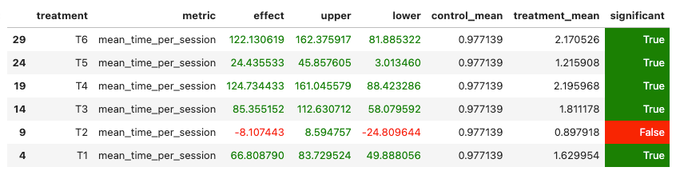

# Домашнее задание 2. Рекомендер музыкальных треков.

*Дедлайн: 14 апреля 2024 23:59 MSK* 

Предложите улучшение сервиса botify и проведите A/B эксперимент. 
Критерий успеха – стат значимое улучшение метрики mean_session_time по сравнению с нейросетевым рекоммендером DSSM (см. таблицу). 
Для проверки необходимо провести честный АВ-тест: в контроле показывать DSSM, а в тритменте - Ваш рекоммендер.
Готовые рекомендации DSSM хранятся в recommendations_dssm.json

## Можно

1. Использовать любые алгоритмы, даже те, про которые в курсе ничего не упоминалось. 
   МЛ, эвристики – что угодно. 
   Главное, чтобы сервис стал лучше.
2. Делиться данными. 
   Сбор данных может занимать довольно долго, поэтому нескольким людям допускается "скинуться" данными.
   У всех один и тот же симулятор, поэтому данные совместимы.
   
## Нельзя

1. Стырить решение коллеги (сюрприз).
2. Пользоваться данными, которые лежат в модуле sim.

## Что на выходе

1. Отчет размером в одну страничку (пожалуйста!), содержащий:
   1. Abstract: основную идею эксперимента (1 параграф)
   2. Детали: минимум того, что нужно знать, чтобы разобраться в реализации (1-2 параграфа + диаграмма)
   3. Результаты A/B эксперимента - в табличке как на семинарах (1 параграф + табличка)
   
2. Ссылка на репозиторий и инструкцию по запуску.
   Инструкция должна включать все от начала до конца: от установки дополнительных пакетов до того, что на какой машине запускается.
   Объем любой, чтобы я мог запустить все на своем ноуте, не думая.

## Итоговая оценка за курс

Максимум за курс можно набрать **100 баллов**.
Итоговая оценка за курс складывается из трех компонент:

- [Макс: 27] Квизы: 9 штук по 3 каждый
- [Макс: 30] Домашка №1: 10 + (s - b) * (20 / (m - b)), где
  - s - ndcg Вашего решения
  - m - ndcg первого в лидерборде решения
  - b - ndсg бейзлайна
- [Макс: 43] Домашка №2: 43 * 0.95^(1 + d) * 0.95^k, где 
  - d - количество полных суток, прошедших после дедлайна, если домашка отправлена после дедлайна, иначе -1
  - k - количество аналогичных решений, которое встретилось проверяющему до проверки вашего решения