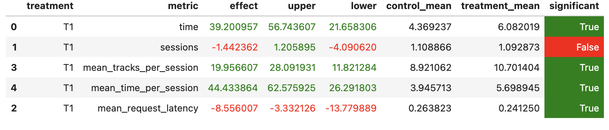

# Abstract
Сделали эвристику на DSSM, которая улучшила результат. Основная идея - похожие треки лежат рядом в рекомендации DSSM.

# Детали
Если у треков похожие эмбеды в модели, то и score будет похожий, поэтому рядом лежат похожие треки в рекомендациях. Тогда будем рекомендовать следущий треки из списка рекомендаций, если предыдущий понравился (прослушал хотя бы половину). Если не понравился, то выдадим рандомный из рекомендаций.

# A/B тест
treatment - эвристика, control - DSSM

# Запуск

- из папка botify запустить докер `docker-compose up -d --build --force-recreate --scale recommender=1`
- из папки sim запустить симуляцию `python -m sim.run --episodes 2000 --config config/env.yml multi --processes 1`
- копировать логи в /tmp `docker cp botify-recommender-1:/app/log/ /tmp/`
- запустить ячейки в ноутбуке `jupyter notebook hw/AB.ipynb`, в самом низу будет результат эксперимента