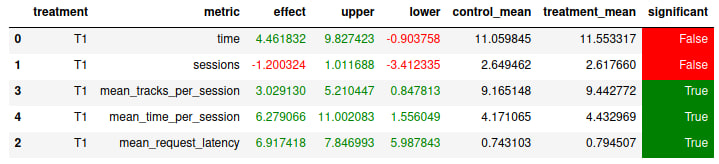

# Abstract

Идея вдохновлена Personalized Page Rank. Заметим, что DSSM-рекомендации сохранены в порядке, отсортированном по значению скалярного произведения (т. е. по релевантности). Будем это использовать, уделяя большее внимание трекам, находящимся в начале списка.

# Детали

В итоге, всё работает так. Давайте за $f(X)$ обозначим функцию, которая возвращает случайный элемент из списка $X$, состоящего из $n$ элементов. Причем выбор осуществляется с весами: первый элемент имеет вес $n^4$, второй имеет вес $(n - 1)^4$, третий имеет вес $(n - 2)^4$, ..., последний имеет вес $1$. Далее действуем согласно следующему алгоритму выбора подходящего трека по предыдущему прослушанному ($t$):

1. Если $t$ нет в списке DSSM-рекомендаций, возвращаем $f(DSSM)$ (аргумент функции &mdash; список DSSM-рекомендаций).
1. Если $t$ является первым или последним в списке $DSSM$, убираем его оттуда и возвращаем $f(DSSM)$.
1. Иначе делим список $DSSM$ на две части: $L$ &mdash; часть списка до $t$ и $R$ &mdash; часть списка после $t$; и с вероятностью $0.1$ возвращаем $f(L)$, а с вероятностью $0.9$ возвращаем $f(R)$.

В итоге, у нас получается некоторое случайное блуждание по списку DSSM-рекомендаций с 10-процентной вероятностью рестарта.

Также для улучшения качества при fallback используем не просто рандом, а "башню" из полученных ранее рекоммендеров (DSSM, Contextual, Top Pop @300, Random).

# Результаты



Как видим, новый рекоммендер побеждает и по количеству треков, и по времени прослушивания.

# Инструкция

### Запускаем сервис

В папке `botify` делаем:

```shell
docker compose up --build --force-recreate --scale recommender=2
```

### Запускаем симулятор

В папке `sim`:

#### Создаем окружение

```shell
conda create -n recsys-2024 python==3.9
```

#### Активириуем окружение

```shell
conda activate recsys-2024
```

#### Устанавливаем зависимости

```shell
pip install -r requirements.txt
```

#### Запускаем симуляцию

```shell
python -m sim.run --episodes 24000 --config config/env.yml single --recommender remote --seed 31337
```

#### Скачиваем данные эксперимента

```shell
python ../script/dataclient.py --recommender 2 log2local ~/Desktop/data/
```

### Смотрим результаты

[Ссылка](./results.ipynb) на ноутбук.
