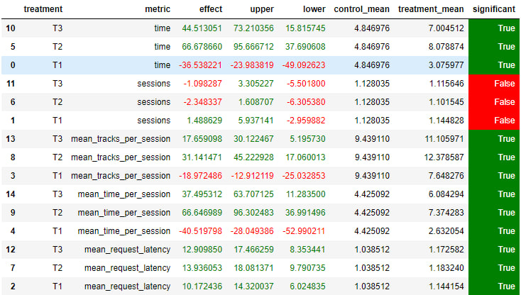

## Задание 2

### Идея

Основная идея - использовать рекомендации от DSSM и Contextual моделей с умом. Во-первых, сервис сохраняет прослушанные треки, чтобы не повторяться. Во-вторых, он берёт рекомендации по пользователю и выбирает лучшие на основе прошлого трека. Это же как раз концепция двухстадийной рекомендации. Ещё я учитывал ранк ретривал рекомендаций.

Также я обучал другие модели для ретривала.

### Детали

`dssm_new.ipynb` - тут я обучал другие dssm, использовал больше данных, артистов, негативный опыт. `sessions.ipynb` - тут я обучал по 3 набора эмбеддингов для пользователя. Он получал 3 набора рекомендаций. Бралась та, в которой есть трек, с которого стартовала сессия. 

`botify/indexed_contextual.py` - рекомендации на основе заготовок для пользователя и трека, который слушали до этого. Я всё пробовал в одной тетрадке, поэтому сейчас там чуть-чуть не та версия, что выдала новые рекомендации.
`botify/session_indexed_contextual.py` - описанная история с наборами эмбеддингов под пользователя

### Результаты

- T1 - рекоммендер с наборами.
- T2 - рекоммендер с новыми DSSM рекомендациями и использованием управлением сессией и контекстуальных рекомендаций
- T3 - T2 со старыми DSSM ретривал рекомендациями

Как видим, даже без новой DSSM новый подход значимо эффективнее по ключевым метрикам. Подход с использованием нескольких наборов рекомендаций уступил. Однако, глобально сервис, работающий лучше старого, построен. 

### Инструкция 

`instructions.md`