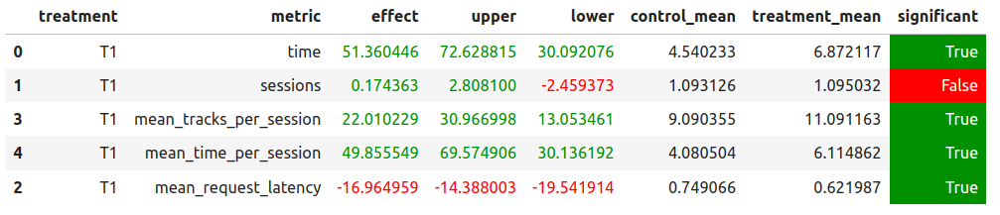

# Описание решения

Будем улучшать DSSM рекомендации.

Обучение ведётся в ноутбуке `./hw/hw2/Week5Seminar_enhanced.ipynb`.

1. Во-первых, понизим количество треков, которые будут считаться положительными примерами, до 18. 
2. Модифицируем также создание негативных примеров:
    * в качестве `hard negative`'ов будем использовать те примеры, которые получили скор из логов `<0.3`.
    * добьём остаток `negative` случайными треками, которые для данного композитора не являеются позитивными.
3. Модель обучалась в течении ~150 эпох.
4. Также учтём тот факт, что рекомендацию сортируются в порядке убывания дистанции эмбеддинга пользователя от эмбеддингов пользователей, поэтому рекомендации стоит выдавать именно в таком порядке, а не в случайном.


## Результаты A/B теста




## Инструкция по воспроизведению результатов

1. Для запуска ноутбука `./hw/hw2/Week5Seminar_enhanced.ipynb` необходимо поставить `conda` окружение, его можно поставить так:
```bash
conda env create --file ./hw/hw2/notebook_env.yml
conda activate
```
2. Прогнать ноутбук `./hw/hw2/Week5Seminar_enhanced.ipynb`
3. Запустить сервис `botify`:
```bash
cd botify
docker-compose up -d --build --force-recreate --scale recommender=2
```
4. Запустить симулятор для прогона A/B теста:
```sh
cd ../sim
python3 -m sim.run --episodes 2000 --config config/env.yml single --recommender remote --seed 31337
```
5. Выгружаем логи сервиса:
```bash
docker cp botify_recommender_1:/app/log/ ../log/
mv ../log/data.json ../log/data_1.json
docker cp botify_recommender_2:/app/log/ ../log/
mv ../log/log/data.json ../log/data_2.json
```
6. Осталось прогнать ноутбук `jupyter/Week1Seminar.ipynb` для получения результатов.
