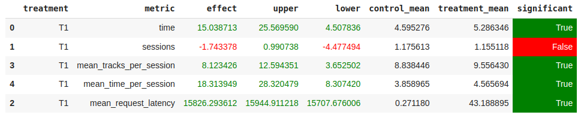

# Result

## Abstract
Так лучшим рекомендером является DSSM, он был выбран как основа рекомендательной ситемы. А для случаев, 
когда фидбек от пользователя явно положительный или отрицательный использовались другие методы, а именно:

1) Отрицательная реакция. Когда DSSM несколько раз подряд (patience) выдаёт плохую рекомендацию (track_time < treshhold), сервис рекомендует 
пользователю трек наименее непохожий на те, которые ему не понравились. Для этого была содана матрица с топом противоположных треков.
2) Положительная реакция. Когда DSSM выдаёт хорошую рекомендацию (track_time > treshhold), сервис дальше рекомендует трек 
похожий на тот, что понравился пользователю.

В остальных случааях рекомендует треки DSSM модель.

## Детали
Для работы сервиса была создана матрица с топом противоположных треков для каждого трека (botify/data/revers_top_indices.npy).
Создана на основе эмбеддингов треков (sim/data/tracks.npy).

Создан класс MixedRecommender (botify/botify/recommenders/mixedRecommender.py), который реализует описанные в abstract функционал.

Для проведения A/B эксперимента был запущен симулятор на 3000 эпизодов. 

Все результаты домашней работы хранятся в папке hw/hw2/results.

## Результаты A/B эксперимента

На таблице видно, что вышеописанный подход по метрике mean_time_per_session показал лучший результат как в среднем, 
так и в экстримальных точка (upper, lower).

