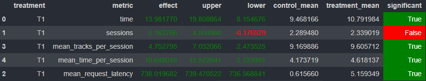

# HW 2

### 1. Модификция симулятора
Добавим в класс `Session` поле `id`, чтобы различать сессии в потоке прослушивания. Информацию о сессиях будем хранить в Redis.

### 2. Сбор данных
Для сбора данных напишем специальный рекомендер `DifferentArtist`, который в рамках одной сессии будет рекомендовать треки разных исполнителей. Собранные данные не будут искажены штрафом за повторное прослушивание исполнителя (и того же трека).

### 3. Обучение модели
Модель обучается в ноутбуке `hw/hw2_solution.ipynb`. Код в нем вдохновлен ноутбуком `Week5Seminar.ipynb`, хоть они и достаточно сильно отличаются. Учится все так же DSSM, но с некоторыми отличиями. Вот, пожалуй, самые значимые из них:
* В качестве фичей треков используются `artist`, `genre` и `pop`
* Негативные сэмплы берутся из хвоста с `time < 0.2`
* Строим 30 рекоммендаций вместо 100

### 4. Реализация рекомендера
В качестве treatment в эксперименте используется рекомендер `Final`. Он рекомендует треки из списка для пользователя в порядке убывания релевантности, но:
* Он никогда не рекомендует один и тот же трек дважды
* Он сортирует список рекомендаций в соответствии с количеством прослушанных треков у исполнителя


# Результат A/B теста


# Инструкция по запуску

1. Создаем среду в conda
```
conda env create -f hw/recsys_env.yml
```

2. Скачиваем [данные](https://drive.google.com/file/d/1IX8omN_xj24ZbJap1-Jflml_9h-67LlD/view?usp=sharing) и помещаем их в папку `logs`.

3. Запускаем ноутбук `hw/hw2_solution.ipynb`

4. Запускаем `botify`, ждем пока он подгрузит рекомендации:
```
docker-compose up -d --build --force-recreate --scale recommender=4
```

5. Запускаем симулятор, собираем данные для A/B теста:
```
python -m sim.run --episodes 5000 --config config/env.yml multi --processes 4
```

6. Создаем папку `results` и выкачиваем данные из `botify`
```
mkdir results
python load_data.py
```

7. Запускаем `jupyter/Week1Seminar.ipynb` и смотрим результаты A/B теста.
