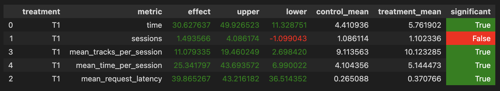

# Отчет по ДЗ2: Рекомендер музыкальных треков.

## Abstract

Разработал рекомендер на основе DSSM, StickyArtist и Contextual рекомендеров. Основная идея заключалась в анализе и улучшении каждого из этих рекомендеров, чтобы использовать их вместе для реализации более качественного. 

## Детали реализации

DSSM, StickyArtist и Contextual - лучшие из описанных нами рекомендеров. Попробуем улучшить их и использовать вместе, чтобы рекомендатовать следующий трек. 

Первое, что я заметил: в DSSM рекомендере мы подбираем рекомендации для пользователя и потом выбираем из них случайный трек. Но стоит заметить, что в полученных рекомендациях айтемы отсортированы по близости к нашему пользователю, от ближайшего к дальнему. Поэтому, первое улучшение заключается в том, чтобы брат треки по порядку из этих рекомендаций.

Алгоритм, описанный выше будет основным для нашего рекомендера. Далее, я решил придумать более хитрый fallback на случай, когда его рекомендации перестанут нравиться пользователю. 

Для этого, будет сохранять статистику пользователя по артистам: считаем количество треков по каждому артисту, треки которого встречались.

Теперь, если время прослушивания последнего трека меньше **T**, то делаем одно из следующих действий:

- с вероятностью **P** выбираем трек артиста, которого пользователь больше всего слушал в течении сессии
- с вероятность **1-P** делаем fallback на Contextual рекомендер

При этом, если рекомендации от основного рекомендера перестали нравиться пользователю, мы от него совсем отказываемся и будет использовать только новую стратегию фолбека.

После недолгого перебора параметров **T** и **P**, удалось достичь стат. значимого улучшения при значениях: 

- **T** = 0.1
- **P** = 0.3

Новый рекомендер описан в файле [**custom.py**](/botify/botify/recommenders/custom.py)

## Результаты

Прирост нового рекомендера по сравнению с DSSM на контроле для mean_session_time составил: 4.1 -> 5.14



## Инструкция по запуску

Запустим сервис Botify с новым рекомендером:
```shell
cd botify
docker-compose up -d --build --force-recreate --scale recommender=2
```

Создадим окружение для симулятора sim по [инструкции](/sim/README.md) и запустим его:
```shell
cd sim
conda activate recsys-2024
python -m sim.run --episodes 2000 --config config/env.yml single --recommender remote --seed 31337
```

Выгрузим данные с сервиса:
```shell
docker cp botify-recommender-1:/app/log/ jupyter/data_logs/data-1.json
docker cp botify-recommender-2:/app/log/ jupyter/data_logs/data-2.json
```

Теперь можно запустить A/B тестирование из ноутбука [*jupyter/Week1Seminar.ipynb*](/jupyter/Week1Seminar.ipynb)