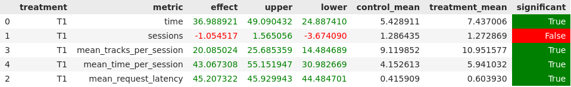

### Описание решения

Основная идея моего решения - клин клином вышибает :)  \
Победил DSSM своей DSSM моделью. Для этого собрал чуток побольше данных (пособирал с семинаров и погенерировал сам, 
причем генерировал с помощью исходной dssm модели, чтобы получать не только нулевые скоры) \
По сути - код (приложен в папке `jupyter/best_recommender.ipynb`) ничем не отличается от семинарского, разве что
я по своему инициализирую веса модели \
Для большего разнообразия данных сгенерировал 125 ближайших соседей

Другие оптимизации: после последнего семинара стала понятно, что рекомендовать один и тот же трек строго запрещено, 
а также помня про discount для artist, было сделано две оптимизации - рекоммендер запоминает последовательность
треков и исполнителей этих треков, которых он уже порекомендовал. Затем идет проверка на то, что случайный трек из рекомендаций
не является повторным, а также что его исполнитель не рекомендовался уже 3 раза (что довольно много по меркам одной сессии).
Если все условия проходят - трек выдается пользователю - иначе рандомится новый (при этом сделана оптимизация, что если
после 10 попыток порекомендовать не вышло - используется fallback)

Истории пользовательских треков и исполнителей записываются в redis (а после сообщения `last` сбрасываются)

И да - в качестве fallback - исходная реализация dssm

### Итоговые результаты:

Тестировалось все случайно (без закрепления сида), поэтому возможны небольшие отклонения, но на моих прогонах
все показало себя с лучшей стороны

### Запуск

Так как и на всех семинарах:\
`cd .\botify\`\
`docker-compose up -d --build --force-recreate --scale recommender=2`\
Проверяем, чтобы сервис запустился\
`cd ../sim`\
`python -m sim.run --episodes 500 --config config/env.yml multi --processes 2`\
`cd ../script`\
`python dataclient.py --recommender 2 log2local $PATH_TO_EXPERIMENT_DATA`

Далее идем в ноутбук первого семинара и смотрим результат эксперимента `BEST_RECOMMENDER`
(В нем, кстати, остался последний мой запуск с табличками и графиками)