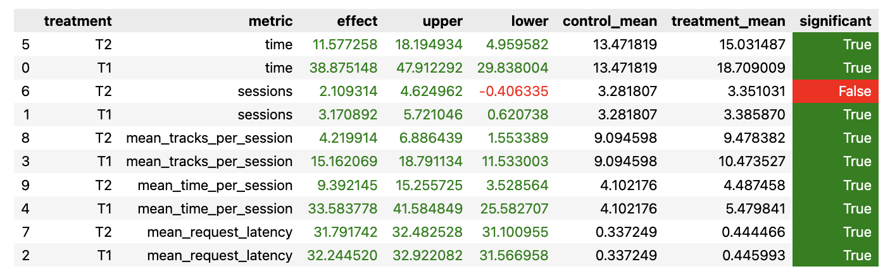

## Отчет о проделанной работе

### Abstract

* попробовала подольше обучать DSSM с увеличенным скрытым слоев (неуспешно)
* комбинация DSSM и LightFM: ориентируюсь на время прослушки прошлого трека
  * 0.3 или меньше => даю случайную из лучших пяти рекомендаций LightFM
  * 0.3 или больше => даю рекомендации из списка DSSM по порядку
* fallback заменила на стандартный DSSM-рекомендер

### Детали реализаци

* `jupyter/dssm_improved.ipynb` - тут лежит ноутбук с кодом, где я пыталась запускать разные вариации DSSM, добавляя фичи, меняя число эпох, размер скрытого слоя и т.п.
* `botify/data/recommendations_dssm_improved.json` - здесь получившийся json
* `botify/config.json`, `botify/server.json` - прописала подключение новой бд
* `botify/experiment.py` - новый эксперимент с названием HW
* `botify/recommenders/ImprovedIndexed.py` - тут лежит код нового рекомендера
  * смотрю на время предыдущего трека. если не больше 0.3, то есть пользователю не особо понравилось, то рассматриваю рекомендации lfm, случайную из последних пяти из них (так как при выгрузке данных в recommendations_lfm.json лучшие треки - в конце списка). некий аналог рестарта со случайного и (надеемся что) релевантного трека
  * иначе проверяю, есть ли предыдущий трек в списке dssm (не важно, из какой рекомендации он пришел), и перехожу к следующему в списке рекомендаций (или нулевому). то есть, если рекомендации dssm 'попали в вайб', то пользователь спокойно слушает их подряд, иначе рестартится
* `botify/server.py` - прописаны две группы treatment
  * T1 - ImprovedIndexed(improved dssm, lfm)
  * T2 - ImprovedIndexed(dssm, lfm)

### Инструкции по воспроизведению

в предположении, что среда настроена по инструкциям

```bash
# поднимаем сервис рекомендера
cd botify && docker-compose stop && docker-compose up -d --build --force-recreate --scale recommender=4

# ждем полминуты, чтобы сервис ожил

# запускаем симулятор пользователя
cd ../sim && conda activate recsys-2024 && python -m sim.run --episodes 8000 --config config/env.yml multi --processes 4

# скачиваем логи всех инстансов рекомендеров
cd ../script && python dataclient.py --recommender 4 log2local <your_path_to_data>
```

дальше запускаем ноутбук `jupyter/ab_test.ipynb`, во второй клеточке прописывая `path_to_data = <your_path_to_data>` из прошлого пункта

### Результаты A/B эксперимента

статистически значимое увеличение метрики `mean_time_per_session` с 4.1 до 5.5 в группе T1 и до 4.5 в группе T2 при запуске A/B тестирования на 8000 эпизодах

(то есть, improved dssm не особо improved получился, но ImprovedIndexed работает)


