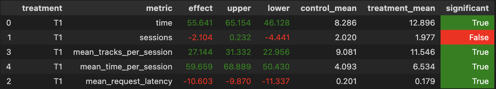

## Идея

Во-первых, в текущей реализации среди кандидатов, предложенных DSSM, осуществлялся выбор случайного из 100 треков.
На самом же деле кандидаты предложены в порядке близости эмбеддингов, и мы можем делать выбор не случайно, а по порядку.

Во-вторых, есть идея учитывать реакцию пользователя на предложенные треки, так как наше множество потенциальных кандидатов для пользователя ограничено. Будем хранить малопрослушанные треки исполнителя как потенциально непонравившиеся и предлагать их в последнюю очередь

Также я решил учитывать кандидатов, предложенных LightFM. Так, если какой-то из кандидатов среди предложений DSSM для конкретного исполнителя есть и среди кандидатов LightFM, то его приоритет немного увеличивается. Благодаря этому получим новый упорядоченный список из 100 кандидатов для каждого пользователя

## Детали реализации

Получаем новый список из кандидатов для каждого пользователя в `jupyter/hw2.ipynb` и сохраняем его в `botify/data/recommendations_my_recsys.json`

В `botify/botify/recommenders/Indexed.py` появился новый класс `StrictIndexed`, который будет предлагать следующий трек способом, описанным выше

Функция `_update_last_tracks` обновляет список последних 60 прослушанных песен пользователя, чтобы не включать их снова
В функции `recommend_next` мы советуем следующий трек исполнителю

Здесь мы обновляем списки непонравившихся треков: удаляем песню, если время прослушивания >0.8 и добавляем, если <0.4

После чего выбираем в порядке приоритетов первый трек, который не в списке последних прослушанных и по возможности не относится к непонравившимся

В `jupyter/ab_test.ipynb` реализован код на основе 1 семинара для проведение A/B теста. В контрольной группе показываются исходные предпочтения на основе DSSM, в тритменте реализуется мое решение

## Результаты

Получилось реализовать статзначимые улучшения метрики `mean_time_per_session` по сравнению с исходным рекоммендером на основе DSSM

Прикладываю изображение с замерами основных метрик, полученное по результатам A/B эксперимента



## Инструкция по запуску

#### Для запуска симулации и сбора результатов

1) Запускаем рекоммендер
```sh
cd ./botify
docker-compose up -d --build --force-recreate --scale recommender=1
```

2) Запускаем симуляцию (требуется немного подождать после выполнения п.1)
```sh
cd ../sim
python -m sim.run --episodes 4000 --config config/env.yml multi --processes 4
```

3) Сохраняем результаты симуляции
```sh
cd ../botify
docker cp botify-recommender-2:/app/log/ /tmp/test
```

> В последней команде с `docker` может понадобиться поменять номер рекоммендера. На `Mac M2 Pro` это `botify-recommender-2`, если он не найдется то запустить с `botify-recommender-1`

#### Для запуска A/B теста

Запускаем ноутбук, лежащий по пути `jupyter/ab_test.ipynb`

> Во второй ячейке ноутбука может быть придется изменить путь, по которому лежат сохраненные данные, если вы его меняли