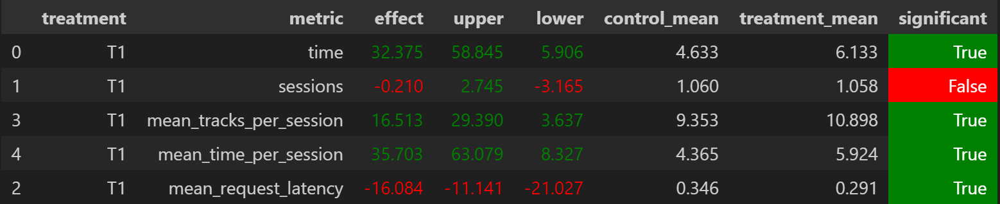

## Идея

Объединяем две эвристики:
- выдача рекоммендаций DSSM по порядку близости вместо случайного порядка
- поддержание списка исполнителей для каждого пользователя, чьи треки "понравились" пользователю (на них было долгое прослушивание)

Суть идеи заключается в том, что несмотря на то, что DSSM действительно выдает качественные рекомендации, возвращать только их сулит слишком большое количество повторений в рекомендациях. Этого хочется избежать посредством подбора трека из потенциально интересных пользователю, но таких, с которыми модель его не познакомит, как только треки из списка рекомендуемых моделью перестают ему нравиться

## Детали

Детали реализации содержатся в классе `IndexedOrderedWithLikedArtists` в файле `botify/botify/recommenders/custom.py`

Для повторения эксперимента необходимо
- из папки `botify` выполнить `docker compose up -d --build --force-recreate --scale recommender=1`
- просимулировать один день с помощью `python -m sim.run --episodes 2000 --config config/env.yml single --recommender remote --seed 42069`
- выгрузить результаты с помощью `python ./script/dataclient.py --recommender 1 log2local ./results/` (нужно убедиться, что директории `results` в корне нет)
- прогнать ноутбук `test.ipynb` в директории `hw2` (предварительно заменив путь до локального репозитория курса на корректный)

## Результаты

При проведении A/B-эксперимента получен статистически значимый прирост по метрикам `time`, `mean_tracks_per_session` и `mean_time_per_session` при увеличении необходимого времени (`mean_request_latency`) на подбор рекомендации (скорее всего из-за тривиальной реализации подбора трека среди треков понравившихся исполнителей)