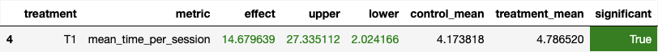

## Идея

Основная идея достаточно простая - не просто выбирать какой-то трек из dsmm или контекстных рекомендаций, а делать взвешанный случайный выбор. То есть я использую популярность трека для задания распределения вероятностей, а также умножаю её на количество списков рекомендаций, в который этот трек попал. Также на всякий случай используй top треки, если вдруг рекомендаций нет.

## Детали реализации

В файле ```recommendres/my_recommender.py``` - реализация recommender-а.

Также добавил полей в ```Track``` из ```track.py```.

## Результаты A/B теста



Можно заметить, что присутствуют небольшие выбросы вниз, но среднее значение не смотря на это превышает значение dsmm.

## Инструкция

```docker-compose up -d --build --force-recreate --scale recommender=1``` - запуск botify

```python3 -m sim.run --episodes 2000 --config config/env.yml single --recommender remote``` - запуск симуляции

```python3 ./script/dataclient.py --recommender 1 log2local ./hw2/data``` - выгрузка результатов

```python3 ab.py``` - запуск A/B теста