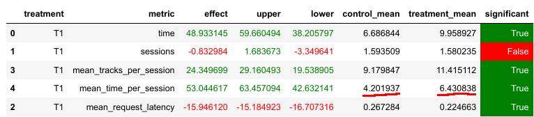

# ДЗ 2. Отчёт

Улучшение DSSM-рекоммендера. Исходная реализация DSSM рекоммендера выдает k=100 ближайших соседей в пространстве эмбеддингов для каждого пользователя, и при этом метод `index.search` из библиотеки `faiss` выдает их в порядке от самых ближайших к более дальним. В исходной реализации на стороне сервера используется шаблонный рекоменндер `Indexed`, которые каждый раз для юзера выбирает случайный из 100 запомненных ближайших соседей. Давайте выбирать не случайный, а в порядке близости: сначала первый по списку, затем второй и так далее. Для этого был реализован рекоммендер `IndexedNew`, и который был запущен на абсолютно тех же данных `../botify/data/recommendations_dssm.json`, и это уже дало статистически значимое улучшение метрики `mean_time_per_session` с 4.2 до 6.4.




# Инструкция

1. Запустить botify:
    ```sh
    docker compose up --detach --build --force-recreate --scale recommender=2
    ```
2. Запустить симулятор:
    ```sh
    python3 -m sim.run --episodes 10000 --config config/env.yml single --recommender remote --seed 228
    ```
3. Выгружаем данные:
    ```sh
    python3 dataclient.py --recommender 2 log2local ~/Desktop/data
    ```
4. Открываем `hw2/HW2.ipynb` и делаем AB-тест - run all cells.
