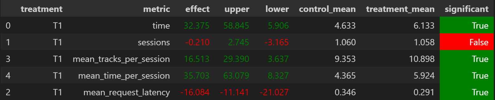

# Abstract

Моё решение использует DSSM в качестве базовой модели. Далее самое важное наблюдение такое: DSSM-рекомендации отсортированы по релевантности, поэтому идти по ним в отсортированом порядке гораздо выгоднее, чем в случайном. После этого я добавил ещё несколько эвристик: если пользователь послушал больше десяти треков, и последний прослушанный трек не понравился ему очень сильно (`time < 0.01`), то начинаем выдавать рекомендации сначала. Если же трек не понравился ему умеренно (`time < 0.3`), то мы в целом продолжаем выдавать рекомендации в порядке сортировки DSSM, но вносим некоторую случайность (сдвигаемся не на единичку, а на сэмпл из геометрического распределения с `p = 0.5`)

# Детали

Логика, описанная в предыдущей секции, реализована в файле `botify/botify/recommenders/hw2_recommender.py`

# Результаты

Запустив эксперимент на 1000 эпизодов, я получил следующие результаты:


# Инструкция по запуску

Запускаем сервис:

```bash
cd botify
docker compose up --detach --build --force-recreate --scale recommender=2
```

Запускаем симуляцию:

```bash
cd ../sim
python -m sim.run --episodes 1000 --config config/env.yml single --recommender remote --seed 31337
```

Выгружаем результаты:
```bash
cd ../script
python dataclient.py --recommender 2 log2local ~/recsys-course-spring-2024/data
```

Чтобы посмотреть результат, запускаем [тетрадку](./ab_test.ipynb)