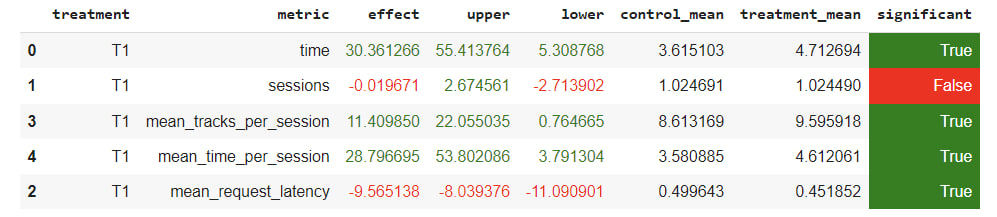

## Описание
Поскольку треки в dssm упорядочены по близости, 
имеет смысл сместить распределение к началу, так, 
чтобы с большей вероятностью сэмплировать ближних
соседей. Реализовано в методе IndexedDistr.

## Как запустить?
 - Установить обновленный лист requirements (или старый
если работает)
 - дальше все как обычно, команда:
python -m sim.run --episodes 500 --config config/env.yml single --recommender 
remote --seed 31337

## Таблица

