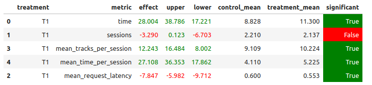

## Отчет

### Основная идея эксперимента

Так как, лучшей моделью по итогам семинарских занятий была признана `DSSM`, то я решила взять ее за основу, внеся некоторые изменения в архитектуру. 
Также был написан новый рекомендер `Best`, выдающий для каждого юзера рекомендации, которые ранее этот юзер не слышал, в порядке, выданном моделью. Если для пользователя нет рекомендаций, то ему выдается случайный трек из топ-100.

### Детали реализации

Изменения, внесенные в `DSSM`:
+ увеличила размер латентного пространства (`embeding_size` с `64` до `256`); 
+ изменила функцию активации (вместо `ReLU` - `ELU`);
+ увеличила размерность слоев `ItemNet` (с `32` до `64`); 
+ уменьшила размер батча (с `2048` до `1024`).

Получила файл с рекомендациями `best.json`.

Рекомендер `Best` собирает информацию о том, какие треки уже были прослушаны каждым юзером. Если предыдущий прослушанный пользователем трек находится в списке рекомендаций `best.json`, то рекомендер выдает следующий по списку трек, при условии, что его ранее не слушали. Если же предыдущего трека нет в списке рекомендаций или следующий по списку трек был прослушан ранее, то тогда возращается первый трек из списка рекомендаций, который пользователь еще не слушал. В качестве `fallback` используется `TopPop`.

### Результаты A/B эксперимента

Удалось статистически значимо улучшить метрики `mean_tracks_per_session` и `mean_time_per_session`:



## Инструкция по запуску

+ Для обучения модели нужно использовать файл `HW_2_DSSM.ipynb`. В результате на гугл-диске сохранится файл `best.json`, который нужно положить по этому пути: `botify/data/best.json`. 

+ Запустить botify и дождаться поднятия сервиса:
```
cd botify; sudo docker compose up -d --build --force-recreate --scale recommender=4
```
+ Запустить симуляцию:
```
cd sim; python3 -m sim.run --episodes 3000 --config config/env.yml multi --processes 4
```
+ По окончании симуляции выгрузить данные симуляции:
```
cd ../script; python dataclient.py --recommender 4 log2local ~/Desktop/data_best
```
+ A/B эксперимент: открыть `jupyter/HW_2_ab_exp.ipynb` и запустить все ячейки.
