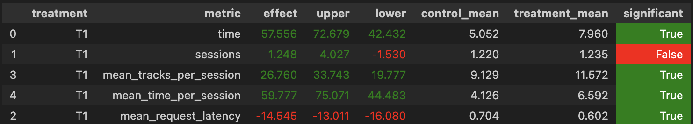

# Abstract

Изначально у меня была идея просто использовать LightFm. Но после череды экспериментов я решил, что можно попробывать модернезировать текущий алгоритм.

# Детали 

LightFm я реализовывал на основе ноутбука 4го семинара. Данные для обучения семплировал с помощью sim. Гипер параметры для фильтрации данных и обучения модели взял из первого дз. Но такое решение было хуже.

Далее я решил модернизировать dssm. Для начала я просто посмотрел, как вообще используются рекомендации и обнаружил, что среди 30 ти самых близких треков мы выбираем рандомный, не используя информацию о предыдущем треке и факт, что это отранжированный список. Попробывал испрвить этот недостаток первым способом, что пришел в голову, а именно брать следующий трек из рекомендаций после последнего прослушанного ,если он есть. И просто первый иначе.

# Результаты

# Инструкция

cd ./botify \
docker-compose up -d --build --force-recreate --scale recommender=1 \
cd ../sim \
python -m sim.run --episodes 1000 --config config/env.yml multi --processes 4 \
docker cp botify-recommender-1:/app/log/ /tmp/ \
(В последней у меня локально почему-то надо было использовать 5ый рекомендер `docker cp botify-recommender-5:/app/log/ /tmp/ `) 

И запускаем ноутбук первого семинар 

