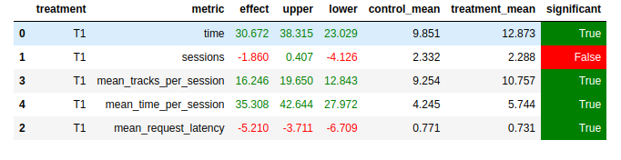

# Abstract
Идея - модифицируем DSSM: используем идею, схожую с epsilon-greedy стратегией из RL

# Детали
Для всех пользователей сделаем epsilon-greedy стратегию: будем переиспользовать треки, которые им понравились. На каждую рекомендацию генерируем число от 0 до 1, если оно меньше, чем epsilon (храним для каждого пользователя свой уровень epsilon) (или список понравившихся треков еще слишком мал), то мы попадаем в исследование, иначе мы выбираем из понравившихся данному пользователю (тот который он дольше других слушал), удаляем его из любимых пользователя и рекомендуем его пользователю снова. Со временем у пользователей epsilon уменьшается, домножением на константу (0.9 в данном случае), тем самым со временем все больше хотим переиспользовать любимые треки.

Исследование выглядит по разному для пользователей, для которых у DSSM есть рекомендация и нет:

Если рекомендация есть, то смотрим на отклик на предыдущий трек, если он сильно не понравился (пользователь слушал < 0.3), то выбираем следущий трек рандомно из рекомендаций, если трек норм, то скорее всего похожие треки тоже будут норм, а значит можно просто идти дальше по рекомендациям

Если рекомендации нет, то просто выдаем рандомный трек

# Результаты

# Запуск

- Запуск Docker'a `docker-compose up -d --build --force-recreate --scale recommender=2`
- Запуск sim `python -m sim.run --episodes 10000 --config config/env.yml multi --processes 1`
- Перемещение логов в tmp `docker cp botify-recommender-1:/app/log/ /tmp/`
- Запустить ячейки в ноутбуке `jupyter-notebook solution/results.ipynb`
